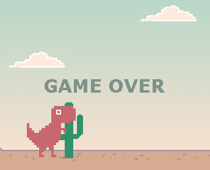

# Juego Dinosaurio

Un juego hecho con JS, HTML y CSS. Proyecto creado en este [tutorial](https://www.youtube.com/watch?v=5gVOlPLz7Hk&list=PLHATK9Uru1ALuq8gfzjWIbBqg3hChwe5m&index=10&ab_channel=GemukiDev).

<h1>
  
</h1>

## Instrucciones para Jugar al Juego del Dinosaurio 

1. Presiona la barra espaciadora en tu teclado para iniciar el juego.
2. El dinosaurio comenzará a correr automáticamente. Utiliza la barra espaciadora para hacer que el dinosaurio salte sobre los cactus y otros obstáculos.
3. Evita chocar con los obstáculos para mantener al dinosaurio corriendo y acumulando puntos.
4. Cuanto más tiempo puedas mantener al dinosaurio corriendo sin chocar, más puntos acumularás.

¡Diviértete jugando al emocionante juego del dinosaurio y desafía tus habilidades de saltar y esquivar obstáculos!
¡Espero que disfrutes del juego!

